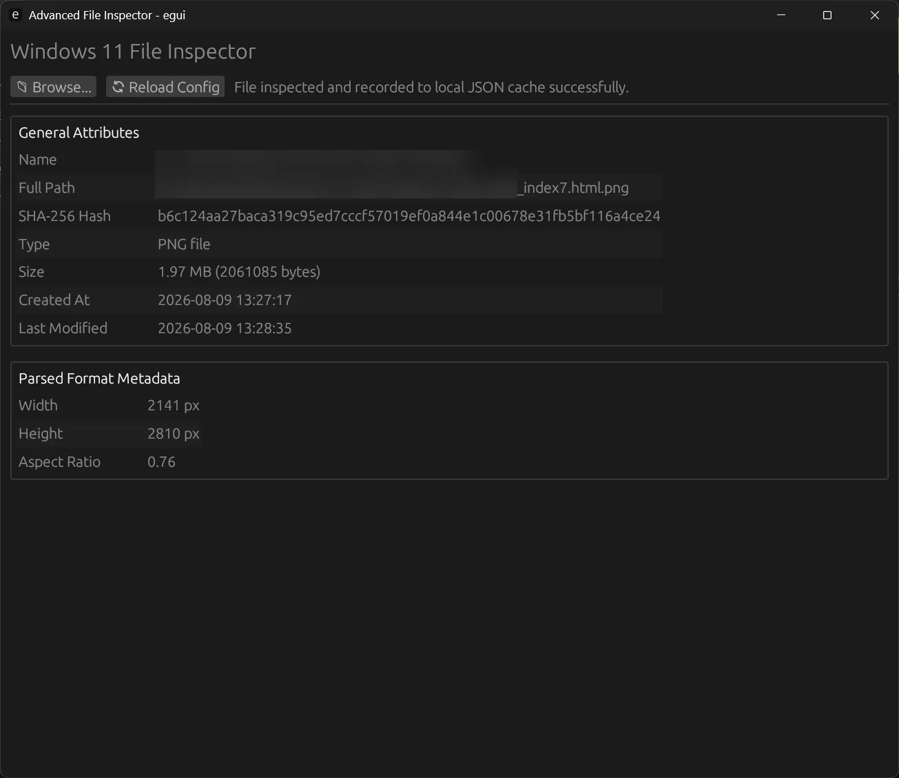
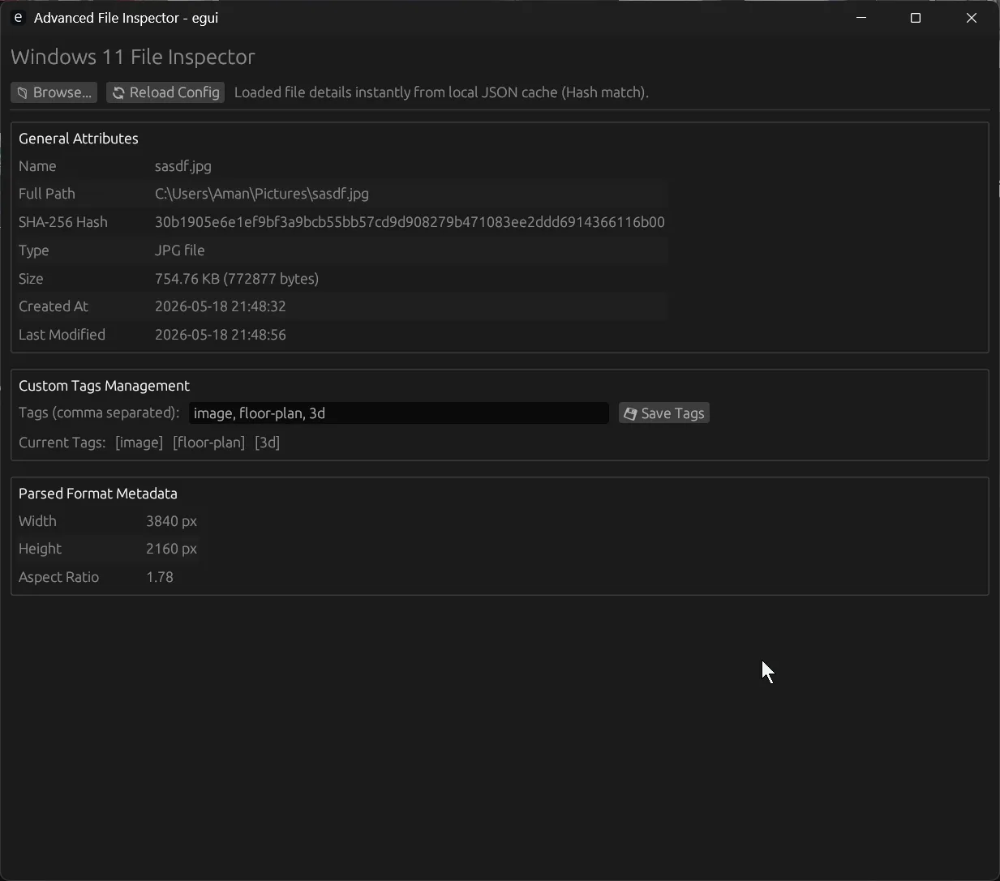
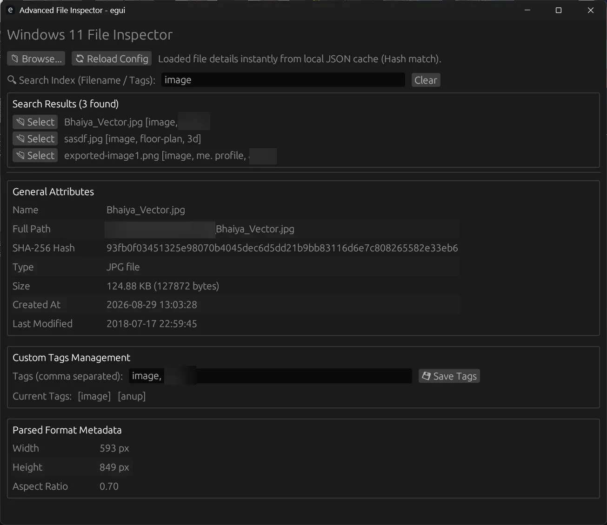
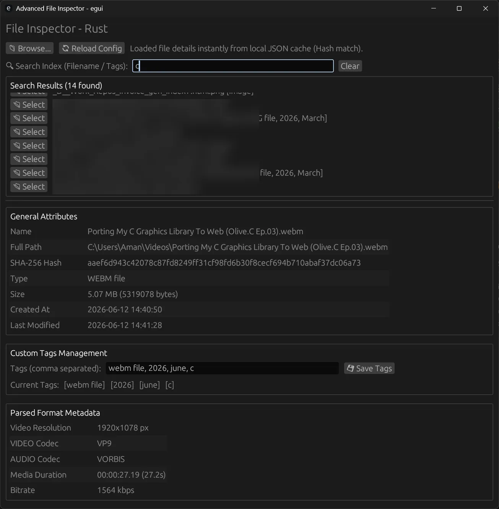
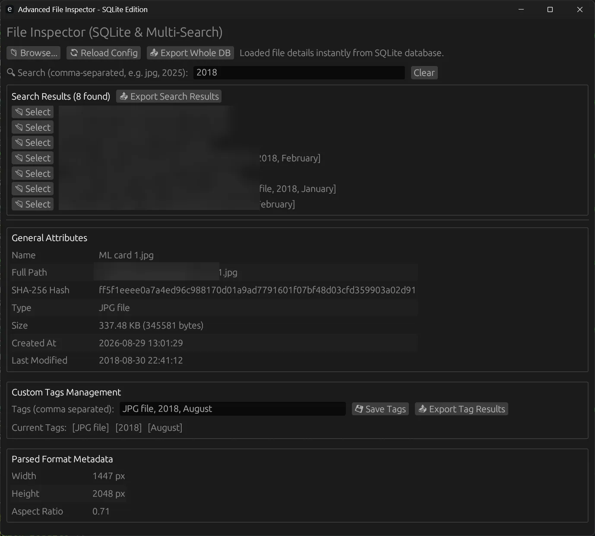
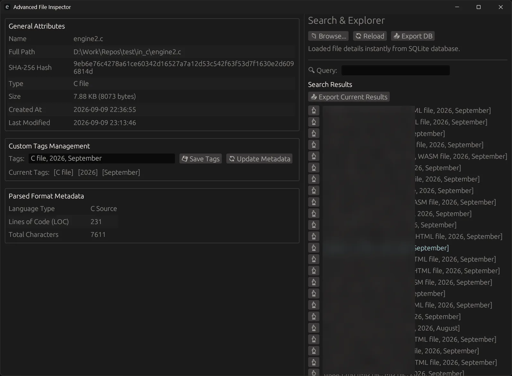

```text
  ███████╗██╗██╗     ███████╗    ██╗███╗   ██╗███████╗██████╗  █████╗  ██████╗████████╗ ██████╗ ██████╗ 
  ██╔════╝██║██║     ██╔════╝    ██║████╗  ██║██╔════╝██╔══██╗██╔══██╗██╔════╝╚══██╔══╝██╔═══██╗██╔══██╗
  █████╗  ██║██║     █████╗      ██║██╔██╗ ██║███████╗██████╔╝███████║██║        ██║   ██║   ██║██████╔╝
  ██╔══╝  ██║██║     ██╔══╝      ██║██║╚██╗██║╚════██║██╔═══╝ ██╔══██║██║        ██║   ██║   ██║██╔══██╗
  ██║     ██║███████╗███████╗    ██║██║ ╚████║███████║██║     ██║  ██║╚██████╗   ██║   ╚██████╔╝██║  ██║
  ╚═╝     ╚═╝╚══════╝╚══════╝    ╚═╝╚═╝  ╚═══╝╚══════╝╚═╝     ╚═╝  ╚═╝ ╚═════╝   ╚═╝    ╚═════╝ ╚═╝  ╚═╝

```

---

## 1. Project Ideation

```text
  +-----------------------------------------------------------------+
  * VISION: A blazingly fast, native desktop utility for deep file  *
  * inspection, recursive directory harvesting, and metadata        *
  * extraction powered by Rust, SQLite, and immediate UI feedback.  *
  +-----------------------------------------------------------------+
```

* **Core Concept**: Drag-and-drop or browse any file/folder to extract hashes, media codecs (via `ffprobe`), image dimensions, and lines of code.
* **Persistent Cache**: Automatically caches metadata and tags into a localized SQLite database (`file_inspector.db`) to ensure instant lookup speeds.
* **Multi-Search & Tagging**: Empowers users to categorize items with custom comma-separated tags, filtering multi-faceted data sets on the fly.

---

## 2. Architecture

```text
  +-------------------+       +-----------------------+       +---------------------+
  *   GUI (Egui)      * <---> * State Management &    * <---> * SQLite Database     *
  *  Event Loop/UI    *       * App Logic (Rust)      *       * (file_inspector.db) *
  +-------------------+       +-----------------------+       +---------------------+
                                         |
                                         v
                              +-----------------------+
                              * External Workers &    *
                              * CLI Tools (FFprobe)   *
                              +-----------------------+

```

* **Frontend Layer**: Built with `eframe` and `egui` providing an immediate-mode graphical user interface.
* **Controller / State Layer**: Handles recursive directory crawlers, SHA-256 hashing (`sha256`), and format parsers (`image`, `ffprobe`).
* **Persistence Layer**: `rusqlite` handles transactional storage mapping hashes to structured file attributes and flexible tags.

---

## 3. Choice of Technologies

```text
  +--------------------+---------------------------------------------+
  * Technology         * Purpose                                     *
  +--------------------+---------------------------------------------+
  * Rust               * Core language for memory safety & speed     *
  * Eframe / Egui      * Immediate-mode cross-platform GUI framework *
  * Rusqlite           * Embedded SQL database engine                *
  * Serde / Serde_json * Serialization and configuration mapping     *
  * FFprobe            * External binary for deep media inspection   *
  +--------------------+---------------------------------------------+
```

---

## 4. Progress in Feature Implementation

* **[x] Single File & Recursive Directory Inspection**: Crawls nested trees while skipping ignored directories (`.git`, `node_modules`, etc.).
* **[x] Persistent SQLite Caching**: Eliminates duplicate hash recalculations by storing records in `file_inspector.db`.
* **[x] Advanced Multi-Search & Filtering**: Search files instantaneously using comma-separated terms across names, tags, and extensions.
* **[x] Tag Management & JSON Exports**: Add custom tags, save them back to the database, and export database subsets or search results to JSON.
* **[x] Metadata Parsers**: Integrated support for image resolutions, source code lines-of-code (LOC) analysis, and multimedia properties.

---

## 5. Project Setup

1. **Prerequisites**: Ensure you have [Rust](https://www.rust-lang.org/) installed along with `ffprobe` (part of FFmpeg) available in your system path for media container analysis.
2. **Clone & Configure**: Create a new Rust binary project and place the application code into `src/main.rs`.
3. **Dependencies (`Cargo.toml`)**:

```toml
[package]
name = "file_inspector"
version = "0.1.0"
edition = "2021"

[dependencies]
eframe = "0.29.0"
egui = "0.29.0"
serde = { version = "1.0", features = ["derive"] }
serde_json = "1.0"
toml = "0.8"
sha256 = "1.5"
image = "0.25"
chrono = "0.4"
rfd = "0.15"
rusqlite = { version = "0.31", features = ["bundled"] }

```

---

## 6. Run Commands

```text
  +-----------------------------------------------------------------+
  * # Build for development release                                 *
  * $ cargo build --release                                         *
  *                                                                 *
  * # Run the application directly                                  *
  * $ cargo run                                                     *
  +-----------------------------------------------------------------+

```

### Screenshots
<!-- - 
- 
- 
- 
- 
-  -->

