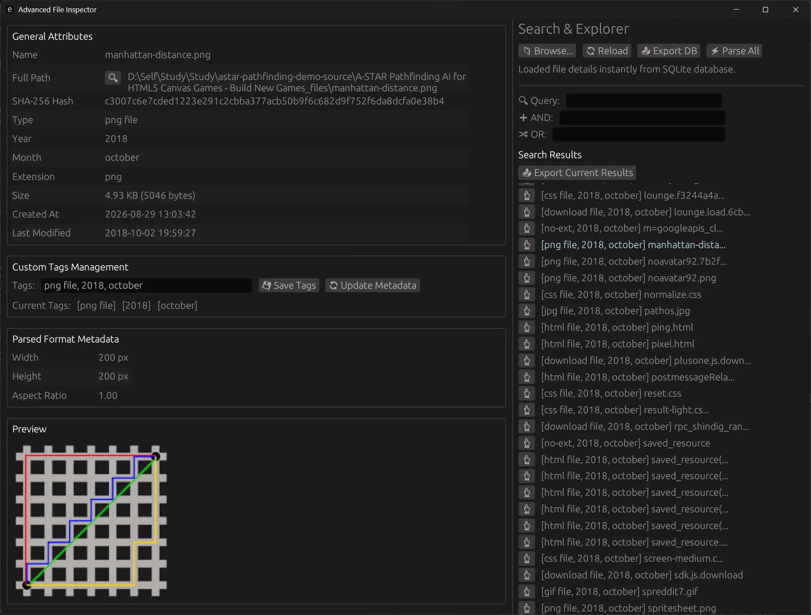
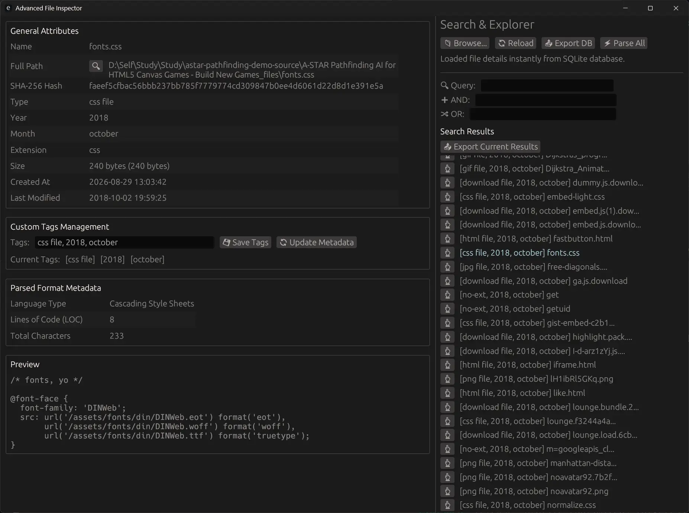

```markdown
  ███████╗██╗██╗     ███████╗    ██╗███╗   ██╗███████╗██████╗  █████╗  ██████╗████████╗ ██████╗ ██████╗ 
  ██╔════╝██║██║     ██╔════╝    ██║████╗  ██║██╔════╝██╔══██╗██╔══██╗██╔════╝╚══██╔══╝██╔═══██╗██╔══██╗
  █████╗  ██║██║     █████╗      ██║██╔██╗ ██║███████╗██████╔╝███████║██║        ██║   ██║   ██║██████╔╝
  ██╔══╝  ██║██║     ██╔══╝      ██║██║╚██╗██║╚════██║██╔═══╝ ██╔══██║██║        ██║   ██║   ██║██╔══██╗
  ██║     ██║███████╗███████╗    ██║██║ ╚████║███████║██║     ██║  ██║╚██████╗   ██║   ╚██████╔╝██║  ██║
  ╚═╝     ╚═╝╚══════╝╚══════╝    ╚═╝╚═╝  ╚═══╝╚══════╝╚═╝     ╚═╝  ╚═╝ ╚═════╝   ╚═╝    ╚═════╝ ╚═╝  ╚═╝
```

---

## 1. Project Ideation & Vision

```text
  +-----------------------------------------------------------------+
  * VISION: A blazingly fast, native desktop utility for deep file  *
  * inspection, recursive directory harvesting, and metadata        *
  * extraction powered by Rust, SQLite, and immediate UI feedback.  *
  +-----------------------------------------------------------------+
```

* **Core Concept**: Drag-and-drop or browse any file/folder to extract hashes, media information, preview images/text contents, and manage file tags seamlessly.

* **Persistent Cache**: Automatically caches metadata and tags into a localized SQLite database (`file_inspector.db`) to ensure instant lookup speeds.

* **Multi-Search & Tagging**: Empowers users to categorize items with custom comma-separated tags, ordering and displaying tags reliably while filtering datasets on the fly.

---

## 2. Architecture

```text
  +-------------------+       +-----------------------+       +---------------------+
  *   GUI (Egui)      * <---> * State Management &    * <---> * SQLite Database     *
  *  Event Loop/UI    *       * App Logic (Rust)      *       * (file_inspector.db) *
  +-------------------+       +-----------------------+       +---------------------+
                                         |
                                         v
                              +-----------------------+
                              * External Workers &    *
                              * File Parsers (Image)  *
                              +-----------------------+

```

* **Frontend Layer**: Built with `eframe` and `egui` providing an immediate-mode graphical user interface with visual selected-file highlighting and live preview panels.


* **Controller / State Layer**: Handles recursive directory crawlers, large directory optimization, smart file exclusions, SHA-256 hashing, and format/metadata parsers.


* **Persistence Layer**: `rusqlite` handles transactional storage mapping hashes to structured file attributes, custom tags, and metadata updates.
---

## 3. Choice of Technologies

```text
  +--------------------+---------------------------------------------+
  * Technology         * Purpose                                     *
  +--------------------+---------------------------------------------+
  * Rust               * Core language for memory safety & speed     *
  * Eframe / Egui      * Immediate-mode cross-platform GUI framework *
  * Rusqlite           * Embedded SQL database engine                *
  * Serde / Serde_json * Serialization and configuration mapping     *
  * FFprobe            * External binary for deep media inspection   *
  +--------------------+---------------------------------------------+
```

---

## 3. Notable Technical Decisions

* **Transition from JSON to SQLite**: Migrated away from flat JSON file storage to an embedded SQLite database (`rusqlite`) to efficiently handle large directory indexing, concurrent lookups, and fast metadata/tag queries without performance degradation.
* **Immediate-Mode UI Layout & Ergonomics**: Utilized `eframe`/`egui` to maintain immediate rendering loops coupled with selective component state management, preventing borrow-checker bottlenecks during high-frequency UI updates and tag mutations.
* **Robust File Traversal & Exclusion Handling**: Implemented custom directory crawling filters to gracefully skip heavy version control directories (`.git`) and build folders (`node_modules`), ensuring responsiveness even when indexing extensive directory trees.
* **Dedicated Batch Actions**: Introduced "Parse All" and "Update Metadata" operations to give users explicit control over bulk processing for scanned files and real-time metadata refreshes.

---

## 4. Progress in Feature Implementation

* **[x] Single File & Recursive Directory Indexing**: Handles massive directory trees efficiently with improved file exclusions and path management.


* **[x] Persistent SQLite Caching**: Fast localized storage mapping file paths and hashes to tags and metadata.


* **[x] Interactive File Previews**: Built-in image and text file content rendering directly inside the inspection layout.
* **[x] Advanced Tagging & Ordering**: Custom tag assignment, structured ordered rendering, bug-free duplicate tag display prevention, and search filtering.
* **[x] File Management & Navigation**: Selected file visual highlighting, quick access to open the parent directory containing the selected file, and batch "Parse All" / "Update Metadata" utilities.

---

## 5. Project Setup & Execution

1. **Prerequisites**: Ensure you have [Rust](https://www.rust-lang.org/) installed.


2. **Clone & Configure**: Clone the repository and inspect the workspace setup.
3. **Dependencies (`Cargo.toml`)**:

```toml
[dependencies]
eframe = "0.31" # Or your preferred recent egui/eframe version
rfd = "0.15"   # Modern portable native file dialogs for Windows 11
image = "0.25" # Image decoding & resolution inspection
serde = { version = "1.0", features = ["derive"] }
serde_json = "1.0"
chrono = "0.4" # Human-readable file timestamps
sha256 = "1.5"
rusqlite = { version = "0.31", features = ["bundled"] }

[profile.release]
opt-level = "z"     # Optimize for size ('s' or 'z')
lto = true          # Enable Link-Time Optimization across all crates
codegen-units = 1   # Reduces parallel code generation to enable maximum LTO optimization
panic = "abort"     # Removes unwinding landing pads (removes string bloat)
strip = true        # Strips debug symbols and symbol tables automatically
```

4. **Run Commands**:
* Build for release: `cargo build --release`

* Run application: `cargo run`


---

### Screenshots


